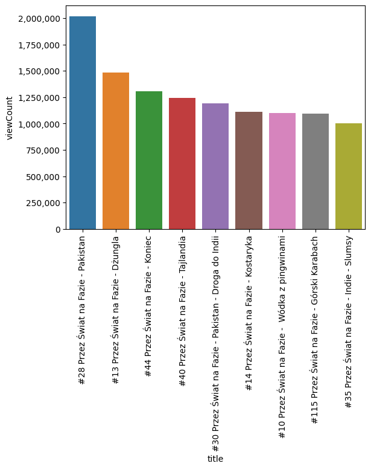
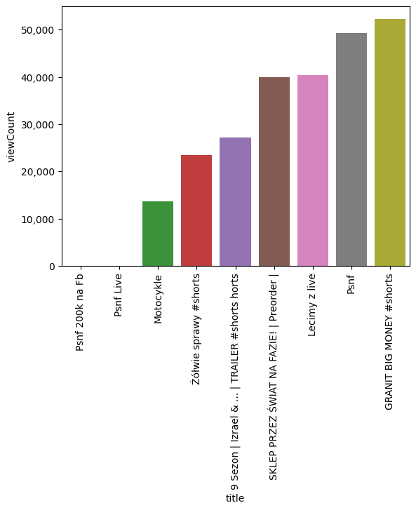
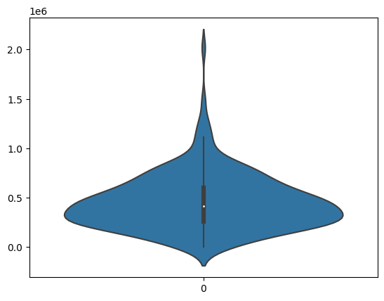
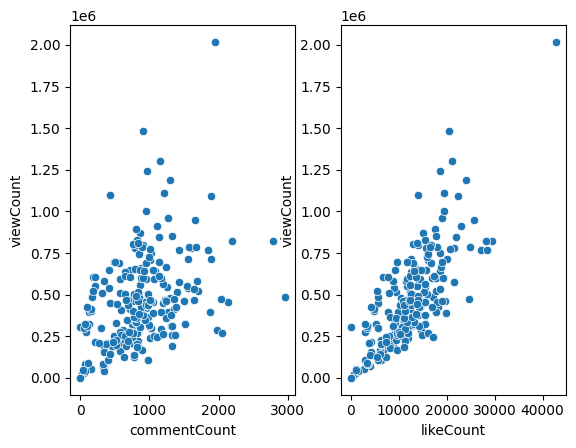
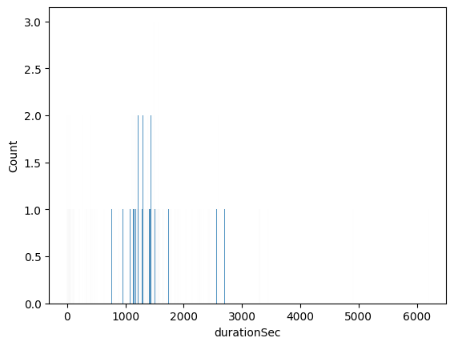

# YOUTUBE API PROJECT


```python
import os
import dotenv
import isodate
import matplotlib.pyplot as plt
import matplotlib.ticker as ticker
import nltk
import pandas as pd
import seaborn as sns

from dateutil import parser
from googleapiclient.discovery import build
from nltk.corpus import stopwords
from nltk.tokenize import word_tokenize
from wordcloud import WordCloud
```


```python
nltk.download('stopwords')
nltk.download('punkt')
```

    [nltk_data] Downloading package stopwords to /home/robert/nltk_data...
    [nltk_data]   Package stopwords is already up-to-date!
    [nltk_data] Downloading package punkt to /home/robert/nltk_data...
    [nltk_data]   Package punkt is already up-to-date!


    True


```python
dotenv.load_dotenv(".env")
```


    True


```python
api_key = os.environ.get("API_KEY")
```

# Data Pull


```python
channel_ids = [
    "UC8uYStXS2ElBFLZVfuYzIxg"
]
```


```python
api_service_name = "youtube"
api_version = "v3"

youtube = build(
    api_service_name, api_version, developerKey=api_key)
```


```python
def get_channel_stats(youtube, channel_ids):

    all_data = []

    request = youtube.channels().list(
        part="snippet,contentDetails,statistics",
        id=','.join(channel_ids)
    )
    response = request.execute()

    for item in response["items"]:
        data = {
            "channelName": item["snippet"]["title"],
            "subscribers": item["statistics"]["subscriberCount"],
            "views": item["statistics"]["viewCount"],
            "totatViews": item["statistics"]["videoCount"],
            "playlistId": item["contentDetails"]["relatedPlaylists"]["uploads"]
        }
        all_data.append(data)
    return(pd.DataFrame(all_data))
```


```python
channel_stats = get_channel_stats(youtube, channel_ids)
```


```python
channel_stats
```


<div>
<style scoped>
    .dataframe tbody tr th:only-of-type {
        vertical-align: middle;
    }

    .dataframe tbody tr th {
        vertical-align: top;
    }

    .dataframe thead th {
        text-align: right;
    }
</style>
<table border="1" class="dataframe">
  <thead>
    <tr style="text-align: right;">
      <th></th>
      <th>channelName</th>
      <th>subscribers</th>
      <th>views</th>
      <th>totatViews</th>
      <th>playlistId</th>
    </tr>
  </thead>
  <tbody>
    <tr>
      <th>0</th>
      <td>Przez Świat Na Fazie</td>
      <td>539000</td>
      <td>104592562</td>
      <td>230</td>
      <td>UU8uYStXS2ElBFLZVfuYzIxg</td>
    </tr>
  </tbody>
</table>
</div>


```python
playlist_id = "UU8uYStXS2ElBFLZVfuYzIxg"
```


```python
def get_video_ids(youtube, playlist_id):

    video_ids = []

    request = youtube.playlistItems().list(
        part="snippet,contentDetails",
        playlistId=playlist_id,
        maxResults=50
    )
    response = request.execute()

    for item in response["items"]:
        video_ids.append(item["contentDetails"]["videoId"])

    next_page_token = response.get("nextPageToken")

    while next_page_token is not None:
        request = youtube.playlistItems().list(
            part="contentDetails",
            playlistId=playlist_id,
            maxResults=50,
            pageToken = next_page_token
        )
        response = request.execute()

        for item in response["items"]:
            video_ids.append(item["contentDetails"]["videoId"])

        next_page_token = response.get("nextPageToken")

    return video_ids
```


```python
video_ids = get_video_ids(youtube, playlist_id)
```


```python
len(video_ids)
```


    232


```python
def get_video_details(youtube, video_ids):
    
    all_video_info = []

    for i in range(0, len(video_ids), 50):
        request = youtube.videos().list(
            part="snippet,contentDetails,statistics",
            id=','.join(video_ids[i:i+50])
        )
        response = request.execute()

        for video in response["items"]:
            stats = {"snippet": ["channelTitle", "title", "description", "tags", "publishedAt"],
                     "statistics": ["viewCount", "likeCount", "commentCount"],
                     "contentDetails": ["duration", "definition", "caption"]
                    }
            video_info = {}
            video_info["video_id"] = video["id"]

            for key in stats.keys():
                for value in stats[key]:
                    try:
                        video_info[value] = video[key][value]
                    except:
                        video_info[value] = None

            all_video_info.append(video_info)
        
    return pd.DataFrame(all_video_info)
```


```python
video_df = get_video_details(youtube, video_ids)
```


```python
video_df
```


<div>
<style scoped>
    .dataframe tbody tr th:only-of-type {
        vertical-align: middle;
    }

    .dataframe tbody tr th {
        vertical-align: top;
    }

    .dataframe thead th {
        text-align: right;
    }
</style>
<table border="1" class="dataframe">
  <thead>
    <tr style="text-align: right;">
      <th></th>
      <th>video_id</th>
      <th>channelTitle</th>
      <th>title</th>
      <th>description</th>
      <th>tags</th>
      <th>publishedAt</th>
      <th>viewCount</th>
      <th>likeCount</th>
      <th>commentCount</th>
      <th>duration</th>
      <th>definition</th>
      <th>caption</th>
    </tr>
  </thead>
  <tbody>
    <tr>
      <th>0</th>
      <td>e8EeMoFA5x0</td>
      <td>Przez Świat Na Fazie</td>
      <td>#167 Przez Świat na Fazie - Wypadek | UZBEKIST...</td>
      <td>Witam Was Fazowicze i Fazowiczki! Przed Wami o...</td>
      <td>[przezswiatnafazie, przez, świat, uzbekistan, ...</td>
      <td>2023-06-18T09:57:13Z</td>
      <td>104750</td>
      <td>6241</td>
      <td>984</td>
      <td>PT18M52S</td>
      <td>hd</td>
      <td>false</td>
    </tr>
    <tr>
      <th>1</th>
      <td>wDQ7h8DU44M</td>
      <td>Przez Świat Na Fazie</td>
      <td>#166 Przez Świat na Fazie - Misja specjalna | ...</td>
      <td>Fazowicze i Fazowiczki! Przed Wami kolejny odc...</td>
      <td>[przezswiatnafazie, patec, patecki, patecwaria...</td>
      <td>2023-06-11T09:57:44Z</td>
      <td>191459</td>
      <td>6497</td>
      <td>484</td>
      <td>PT25M5S</td>
      <td>hd</td>
      <td>false</td>
    </tr>
    <tr>
      <th>2</th>
      <td>0nSR4DXhL-g</td>
      <td>Przez Świat Na Fazie</td>
      <td>#165 Przez Świat na Fazie - Awantura w autobus...</td>
      <td>Fazowicze i Fazowiczki! Przed Wami kolejny odc...</td>
      <td>[przezswiatnafazie, patecki, patecwariatec, fa...</td>
      <td>2023-06-04T08:58:58Z</td>
      <td>207455</td>
      <td>7085</td>
      <td>565</td>
      <td>PT24M6S</td>
      <td>hd</td>
      <td>false</td>
    </tr>
    <tr>
      <th>3</th>
      <td>DZ6W6flhUfg</td>
      <td>Przez Świat Na Fazie</td>
      <td>#164 Przez Świat na Fazie - Przygodę czas zacz...</td>
      <td>Witam Was serdecznie Fazowicze i Fazowiczki. P...</td>
      <td>[przezswiatnafazie, na fazie, przez, izrael, p...</td>
      <td>2023-05-28T09:58:59Z</td>
      <td>191908</td>
      <td>8506</td>
      <td>465</td>
      <td>PT21M47S</td>
      <td>hd</td>
      <td>false</td>
    </tr>
    <tr>
      <th>4</th>
      <td>ViwsE2S0-E4</td>
      <td>Przez Świat Na Fazie</td>
      <td>#163 Przez Świat na Fazie - Ostry poślizg | IZ...</td>
      <td>Fazowicze i Fazowiczki! Zapraszam Was na ostat...</td>
      <td>[przezswiatnafazie, na fazie, przez, izrael, p...</td>
      <td>2023-05-21T09:57:43Z</td>
      <td>163891</td>
      <td>6620</td>
      <td>575</td>
      <td>PT22M59S</td>
      <td>hd</td>
      <td>false</td>
    </tr>
    <tr>
      <th>...</th>
      <td>...</td>
      <td>...</td>
      <td>...</td>
      <td>...</td>
      <td>...</td>
      <td>...</td>
      <td>...</td>
      <td>...</td>
      <td>...</td>
      <td>...</td>
      <td>...</td>
      <td>...</td>
    </tr>
    <tr>
      <th>227</th>
      <td>NEKVy_34HVs</td>
      <td>Przez Świat Na Fazie</td>
      <td>5# Przez Świat na Fazie - Jachtostop</td>
      <td></td>
      <td>[przez świat na fazie, fazowski, na fazie prze...</td>
      <td>2014-11-02T15:16:57Z</td>
      <td>309591</td>
      <td>3472</td>
      <td>94</td>
      <td>PT5M32S</td>
      <td>hd</td>
      <td>false</td>
    </tr>
    <tr>
      <th>228</th>
      <td>p79FR9uA0uA</td>
      <td>Przez Świat Na Fazie</td>
      <td>#2 Przez Świat na Fazie - Hiszpania</td>
      <td></td>
      <td>[przez świat na fazie, fazowski, na fazie prze...</td>
      <td>2014-10-23T12:33:14Z</td>
      <td>520508</td>
      <td>5563</td>
      <td>189</td>
      <td>PT6M44S</td>
      <td>hd</td>
      <td>false</td>
    </tr>
    <tr>
      <th>229</th>
      <td>bLoWNzsbYug</td>
      <td>Przez Świat Na Fazie</td>
      <td>#4 Przez Świat na Fazie - No to płyniemy po oc...</td>
      <td></td>
      <td>[przez świat na fazie, fazowski, na fazie prze...</td>
      <td>2014-10-10T19:57:59Z</td>
      <td>425180</td>
      <td>4259</td>
      <td>94</td>
      <td>PT3M34S</td>
      <td>hd</td>
      <td>false</td>
    </tr>
    <tr>
      <th>230</th>
      <td>OMjmmD9WF8Q</td>
      <td>Przez Świat Na Fazie</td>
      <td>#3 Przez Świat na Fazie - Giblartar</td>
      <td></td>
      <td>[przez świat na fazie, fazowski, na fazie prze...</td>
      <td>2014-09-30T11:39:49Z</td>
      <td>321621</td>
      <td>2980</td>
      <td>67</td>
      <td>PT1M57S</td>
      <td>hd</td>
      <td>false</td>
    </tr>
    <tr>
      <th>231</th>
      <td>7Otppg5kvQs</td>
      <td>Przez Świat Na Fazie</td>
      <td>#1 Przez Świat na Fazie</td>
      <td></td>
      <td>[przez świat na fazie, fazowski, na fazie prze...</td>
      <td>2014-08-07T23:10:57Z</td>
      <td>606957</td>
      <td>7786</td>
      <td>215</td>
      <td>PT40S</td>
      <td>hd</td>
      <td>false</td>
    </tr>
  </tbody>
</table>
<p>232 rows × 12 columns</p>
</div>


## Data Pre-processing


```python
video_df.isnull().any()
```


    video_id        False
    channelTitle    False
    title           False
    description     False
    tags            False
    publishedAt     False
    viewCount       False
    likeCount       False
    commentCount    False
    duration        False
    definition      False
    caption         False
    dtype: bool


```python
video_df.dtypes
```


    video_id        object
    channelTitle    object
    title           object
    description     object
    tags            object
    publishedAt     object
    viewCount       object
    likeCount       object
    commentCount    object
    duration        object
    definition      object
    caption         object
    dtype: object


```python
numeric_cols = ["viewCount", "likeCount", "commentCount"]
video_df[numeric_cols] = video_df[numeric_cols].apply(pd.to_numeric, errors = "coerce", axis = 1)
```


```python
video_df["publishedAt"] = video_df["publishedAt"].apply(lambda x: parser.parse(x))
```


```python
video_df["publishDay"] = video_df["publishedAt"].apply(lambda x: x.strftime("%A"))
```


```python
video_df
```


<div>
<style scoped>
    .dataframe tbody tr th:only-of-type {
        vertical-align: middle;
    }

    .dataframe tbody tr th {
        vertical-align: top;
    }

    .dataframe thead th {
        text-align: right;
    }
</style>
<table border="1" class="dataframe">
  <thead>
    <tr style="text-align: right;">
      <th></th>
      <th>video_id</th>
      <th>channelTitle</th>
      <th>title</th>
      <th>description</th>
      <th>tags</th>
      <th>publishedAt</th>
      <th>viewCount</th>
      <th>likeCount</th>
      <th>commentCount</th>
      <th>duration</th>
      <th>definition</th>
      <th>caption</th>
      <th>publishDay</th>
    </tr>
  </thead>
  <tbody>
    <tr>
      <th>0</th>
      <td>e8EeMoFA5x0</td>
      <td>Przez Świat Na Fazie</td>
      <td>#167 Przez Świat na Fazie - Wypadek | UZBEKIST...</td>
      <td>Witam Was Fazowicze i Fazowiczki! Przed Wami o...</td>
      <td>[przezswiatnafazie, przez, świat, uzbekistan, ...</td>
      <td>2023-06-18 09:57:13+00:00</td>
      <td>104750</td>
      <td>6241</td>
      <td>984</td>
      <td>PT18M52S</td>
      <td>hd</td>
      <td>false</td>
      <td>Sunday</td>
    </tr>
    <tr>
      <th>1</th>
      <td>wDQ7h8DU44M</td>
      <td>Przez Świat Na Fazie</td>
      <td>#166 Przez Świat na Fazie - Misja specjalna | ...</td>
      <td>Fazowicze i Fazowiczki! Przed Wami kolejny odc...</td>
      <td>[przezswiatnafazie, patec, patecki, patecwaria...</td>
      <td>2023-06-11 09:57:44+00:00</td>
      <td>191459</td>
      <td>6497</td>
      <td>484</td>
      <td>PT25M5S</td>
      <td>hd</td>
      <td>false</td>
      <td>Sunday</td>
    </tr>
    <tr>
      <th>2</th>
      <td>0nSR4DXhL-g</td>
      <td>Przez Świat Na Fazie</td>
      <td>#165 Przez Świat na Fazie - Awantura w autobus...</td>
      <td>Fazowicze i Fazowiczki! Przed Wami kolejny odc...</td>
      <td>[przezswiatnafazie, patecki, patecwariatec, fa...</td>
      <td>2023-06-04 08:58:58+00:00</td>
      <td>207455</td>
      <td>7085</td>
      <td>565</td>
      <td>PT24M6S</td>
      <td>hd</td>
      <td>false</td>
      <td>Sunday</td>
    </tr>
    <tr>
      <th>3</th>
      <td>DZ6W6flhUfg</td>
      <td>Przez Świat Na Fazie</td>
      <td>#164 Przez Świat na Fazie - Przygodę czas zacz...</td>
      <td>Witam Was serdecznie Fazowicze i Fazowiczki. P...</td>
      <td>[przezswiatnafazie, na fazie, przez, izrael, p...</td>
      <td>2023-05-28 09:58:59+00:00</td>
      <td>191908</td>
      <td>8506</td>
      <td>465</td>
      <td>PT21M47S</td>
      <td>hd</td>
      <td>false</td>
      <td>Sunday</td>
    </tr>
    <tr>
      <th>4</th>
      <td>ViwsE2S0-E4</td>
      <td>Przez Świat Na Fazie</td>
      <td>#163 Przez Świat na Fazie - Ostry poślizg | IZ...</td>
      <td>Fazowicze i Fazowiczki! Zapraszam Was na ostat...</td>
      <td>[przezswiatnafazie, na fazie, przez, izrael, p...</td>
      <td>2023-05-21 09:57:43+00:00</td>
      <td>163891</td>
      <td>6620</td>
      <td>575</td>
      <td>PT22M59S</td>
      <td>hd</td>
      <td>false</td>
      <td>Sunday</td>
    </tr>
    <tr>
      <th>...</th>
      <td>...</td>
      <td>...</td>
      <td>...</td>
      <td>...</td>
      <td>...</td>
      <td>...</td>
      <td>...</td>
      <td>...</td>
      <td>...</td>
      <td>...</td>
      <td>...</td>
      <td>...</td>
      <td>...</td>
    </tr>
    <tr>
      <th>227</th>
      <td>NEKVy_34HVs</td>
      <td>Przez Świat Na Fazie</td>
      <td>5# Przez Świat na Fazie - Jachtostop</td>
      <td></td>
      <td>[przez świat na fazie, fazowski, na fazie prze...</td>
      <td>2014-11-02 15:16:57+00:00</td>
      <td>309591</td>
      <td>3472</td>
      <td>94</td>
      <td>PT5M32S</td>
      <td>hd</td>
      <td>false</td>
      <td>Sunday</td>
    </tr>
    <tr>
      <th>228</th>
      <td>p79FR9uA0uA</td>
      <td>Przez Świat Na Fazie</td>
      <td>#2 Przez Świat na Fazie - Hiszpania</td>
      <td></td>
      <td>[przez świat na fazie, fazowski, na fazie prze...</td>
      <td>2014-10-23 12:33:14+00:00</td>
      <td>520508</td>
      <td>5563</td>
      <td>189</td>
      <td>PT6M44S</td>
      <td>hd</td>
      <td>false</td>
      <td>Thursday</td>
    </tr>
    <tr>
      <th>229</th>
      <td>bLoWNzsbYug</td>
      <td>Przez Świat Na Fazie</td>
      <td>#4 Przez Świat na Fazie - No to płyniemy po oc...</td>
      <td></td>
      <td>[przez świat na fazie, fazowski, na fazie prze...</td>
      <td>2014-10-10 19:57:59+00:00</td>
      <td>425180</td>
      <td>4259</td>
      <td>94</td>
      <td>PT3M34S</td>
      <td>hd</td>
      <td>false</td>
      <td>Friday</td>
    </tr>
    <tr>
      <th>230</th>
      <td>OMjmmD9WF8Q</td>
      <td>Przez Świat Na Fazie</td>
      <td>#3 Przez Świat na Fazie - Giblartar</td>
      <td></td>
      <td>[przez świat na fazie, fazowski, na fazie prze...</td>
      <td>2014-09-30 11:39:49+00:00</td>
      <td>321621</td>
      <td>2980</td>
      <td>67</td>
      <td>PT1M57S</td>
      <td>hd</td>
      <td>false</td>
      <td>Tuesday</td>
    </tr>
    <tr>
      <th>231</th>
      <td>7Otppg5kvQs</td>
      <td>Przez Świat Na Fazie</td>
      <td>#1 Przez Świat na Fazie</td>
      <td></td>
      <td>[przez świat na fazie, fazowski, na fazie prze...</td>
      <td>2014-08-07 23:10:57+00:00</td>
      <td>606957</td>
      <td>7786</td>
      <td>215</td>
      <td>PT40S</td>
      <td>hd</td>
      <td>false</td>
      <td>Thursday</td>
    </tr>
  </tbody>
</table>
<p>232 rows × 13 columns</p>
</div>


```python
video_df['durationSec'] = video_df['duration'].apply(lambda x: isodate.parse_duration(x))
```


```python
video_df['durationSec'] = video_df['durationSec'].astype('timedelta64[s]')
```


```python
video_df[["durationSec", "duration"]]
```


<div>
<style scoped>
    .dataframe tbody tr th:only-of-type {
        vertical-align: middle;
    }

    .dataframe tbody tr th {
        vertical-align: top;
    }

    .dataframe thead th {
        text-align: right;
    }
</style>
<table border="1" class="dataframe">
  <thead>
    <tr style="text-align: right;">
      <th></th>
      <th>durationSec</th>
      <th>duration</th>
    </tr>
  </thead>
  <tbody>
    <tr>
      <th>0</th>
      <td>0 days 00:18:52</td>
      <td>PT18M52S</td>
    </tr>
    <tr>
      <th>1</th>
      <td>0 days 00:25:05</td>
      <td>PT25M5S</td>
    </tr>
    <tr>
      <th>2</th>
      <td>0 days 00:24:06</td>
      <td>PT24M6S</td>
    </tr>
    <tr>
      <th>3</th>
      <td>0 days 00:21:47</td>
      <td>PT21M47S</td>
    </tr>
    <tr>
      <th>4</th>
      <td>0 days 00:22:59</td>
      <td>PT22M59S</td>
    </tr>
    <tr>
      <th>...</th>
      <td>...</td>
      <td>...</td>
    </tr>
    <tr>
      <th>227</th>
      <td>0 days 00:05:32</td>
      <td>PT5M32S</td>
    </tr>
    <tr>
      <th>228</th>
      <td>0 days 00:06:44</td>
      <td>PT6M44S</td>
    </tr>
    <tr>
      <th>229</th>
      <td>0 days 00:03:34</td>
      <td>PT3M34S</td>
    </tr>
    <tr>
      <th>230</th>
      <td>0 days 00:01:57</td>
      <td>PT1M57S</td>
    </tr>
    <tr>
      <th>231</th>
      <td>0 days 00:00:40</td>
      <td>PT40S</td>
    </tr>
  </tbody>
</table>
<p>232 rows × 2 columns</p>
</div>


```python
video_df["tagCount"] = video_df["tags"].apply(lambda x: 0 if x is None else len(x))
```


```python
video_df["tagCount"]
```


    0      33
    1      33
    2      32
    3      31
    4      31
           ..
    227     9
    228     9
    229     9
    230     9
    231     9
    Name: tagCount, Length: 232, dtype: int64


# Most watched videos


```python
ax = sns.barplot(x = "title", y = "viewCount", data = video_df.sort_values("viewCount", ascending=False)[0:9])
ax.yaxis.set_major_formatter(ticker.FuncFormatter(lambda x, _: f"{int(x):,}"))
plot = ax.set_xticklabels(ax.get_xticklabels(), rotation=90)
```


    

    


# Least watched videos


```python
ax = sns.barplot(x = "title", y = "viewCount", data = video_df.sort_values("viewCount", ascending=True)[0:9])
ax.yaxis.set_major_formatter(ticker.FuncFormatter(lambda x, _: f"{int(x):,}"))
plot = ax.set_xticklabels(ax.get_xticklabels(), rotation=90)
```


    

    


# View distribution


```python
sns.violinplot(video_df["viewCount"])
```


    <Axes: >


    

    


```python
fix, ax = plt.subplots(1, 2)
sns.scatterplot(data = video_df, x = "commentCount", y = "viewCount", ax = ax[0])
sns.scatterplot(data = video_df, x = "likeCount", y = "viewCount", ax = ax[1])
```


    <Axes: xlabel='likeCount', ylabel='viewCount'>


    

    


```python
sns.histplot(data = video_df, x = "durationSec", bins=30)
```


    <Axes: xlabel='durationSec', ylabel='Count'>


    

    


## Wordcloud


```python
video_df['title_words'] = video_df['title'].apply(lambda x: [item for item in str(x).split()])

all_words = list([a for b in video_df['title_words'].tolist() for a in b])
all_words_str = ' '.join(all_words) 

def plot_cloud(wordcloud):
    plt.figure(figsize=(30, 20))
    plt.imshow(wordcloud) 
    plt.axis("off");

wordcloud = WordCloud(width = 2000, height = 1000, random_state=1, background_color='black', 
                      colormap='viridis', collocations=False).generate(all_words_str)
plot_cloud(wordcloud)
```


    

    

